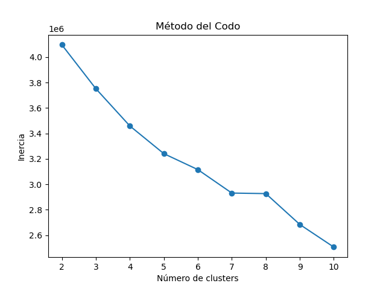
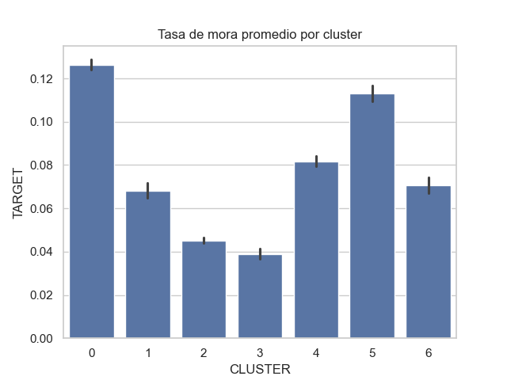
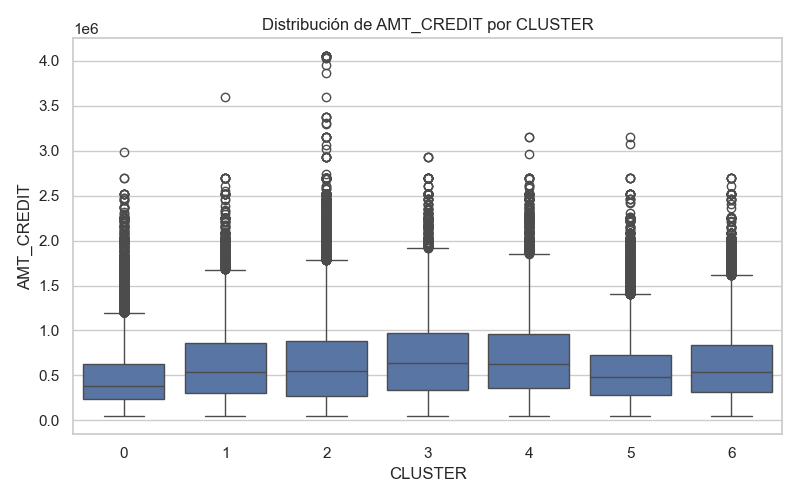
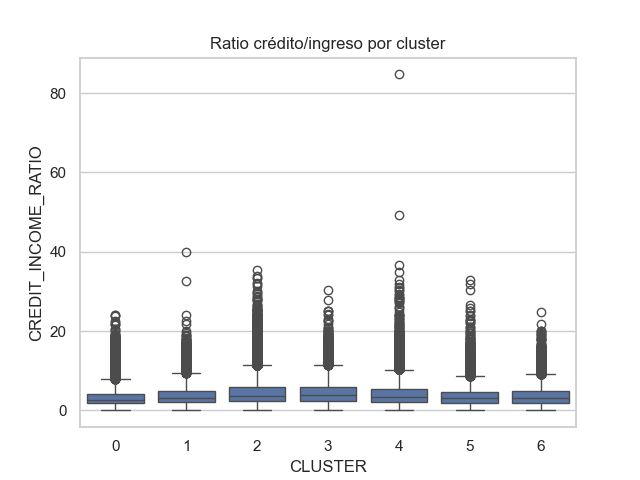
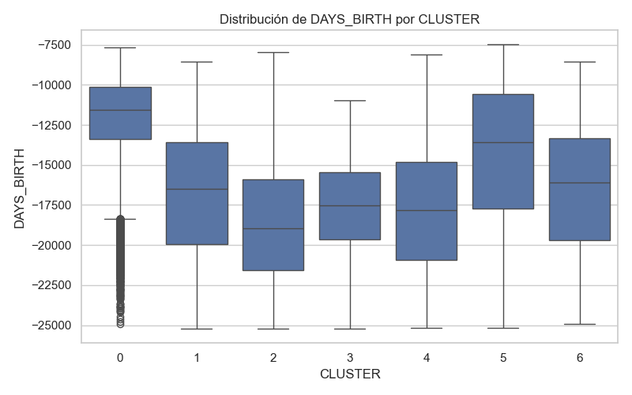
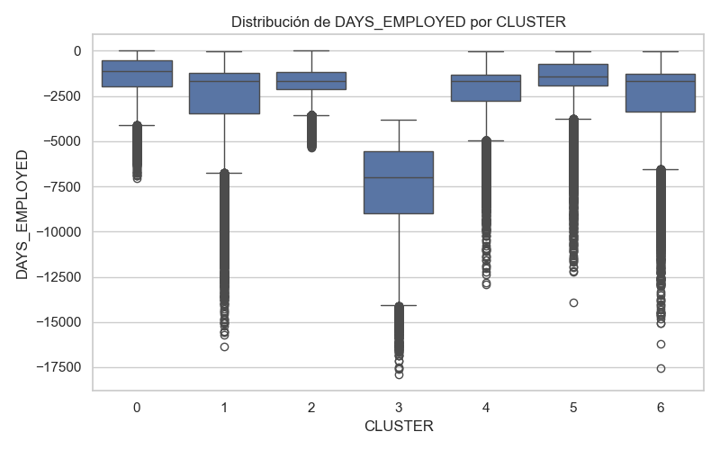
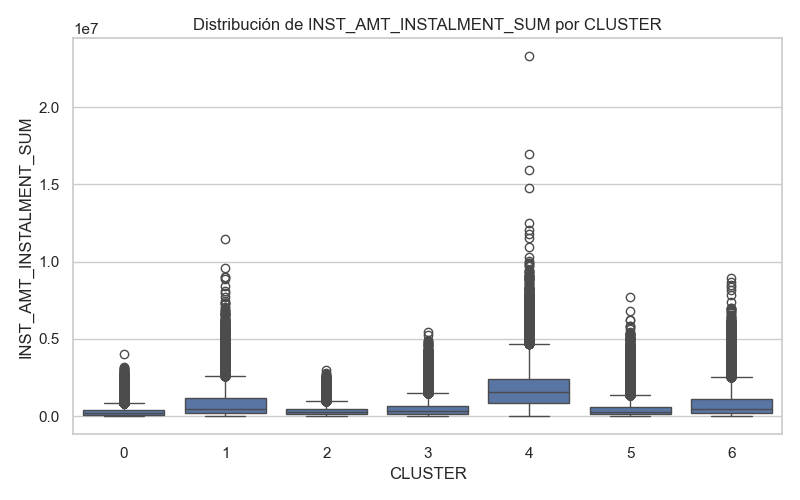

## Análisis de Segmentación con Clustering (Modelo No Supervisado)

Este análisis tiene como objetivo segmentar a los clientes según características numéricas para identificar perfiles de riesgo diferenciados.

---

### 🔹 1. Selección de variables

Se aplicaron tres pasos para reducir el número de variables:

1. **Filtro de baja varianza** (`threshold=0.01`)
2. **Eliminación de variables altamente correlacionadas** (`r > 0.9`)
3. **Ranking por varianza inter-cluster (KMeans)** → se eligieron las 10 más informativas

A estas se sumaron variables clave para la segmentación de los clientes como `AMT_CREDIT`, `DAYS_BIRTH`, `EXT_SOURCE_1/2/3`.

---

### 🔹 2. Determinación del número de clusters

Se utilizó el **método del codo** (inercia) para determinar el número óptimo de clusters (`k=7`), dado que como se observa en la grafica de inercia, el cambio mas abrupto en la pendiente de la curva se da en el punto .

---

### 🔹 3. Ejecución de KMeans
Se utilizó el algoritmo **K-Means** para realizar la segmentación de clientes por las siguientes razones:

- Es un método eficiente y escalable para grandes volúmenes de datos como el dataset de Home Credit.
- Permite identificar patrones y estructuras ocultas en los datos sin necesidad de variable objetivo.
- Genera grupos homogéneos con base en la distancia euclidiana entre observaciones, lo que facilita el análisis posterior de perfiles de clientes.
- Es compatible con el uso de variables numéricas estandarizadas, como las obtenidas en nuestro preprocesamiento.
- Su simplicidad computacional permite calcular fácilmente el número óptimo de clusters mediante el método del codo.
Estos motivos lo convierten en una opción sólida para una primera segmentación no supervisada orientada a identificar diferentes niveles de riesgo en la cartera de clientes.

Se aplicó `KMeans(n_clusters=7)` sobre los datos estandarizados.  
A cada cliente se le asignó un `CLUSTER` entre 0 y 6.

---

### 🔹 4. Análisis de resultados

Se analizó:

- **Promedios por cluster** (edad, crédito, ingreso)
### 🔹 Comparación de perfiles por cluster

Se seleccionaron variables clave para describir el comportamiento promedio de los clientes en cada grupo. La siguiente tabla resume los principales indicadores por cluster:

| Cluster | Tasa Mora (`TARGET`) | Crédito Prom. (`AMT_CREDIT`) | Ingreso Prom. (`AMT_INCOME_TOTAL`) | Edad Prom. (años) | Antigüedad Prom. (años) | EXT_SOURCE_1 | EXT_SOURCE_2 | EXT_SOURCE_3 |
|---------|----------------------|------------------------------|------------------------------------|-------------------|--------------------------|---------------|---------------|---------------|
| 0       | 0.13                 | 468,538                      | 154,753                            | 32.6              | 3.9                      | 0.42          | 0.44          | 0.46          |
| 1       | 0.07                 | 635,963                      | 184,750                            | 46.0              | 7.3                      | 0.52          | 0.53          | 0.52          |
| 2       | 0.05                 | 637,223                      | 158,547                            | 51.2              | 4.9                      | 0.56          | 0.56          | 0.59          |
| 3       | 0.04                 | 705,973                      | 177,131                            | 48.2              | 20.8                     | 0.55          | 0.56          | 0.57          |
| 4       | 0.08                 | 698,386                      | 191,560                            | 48.6              | 5.9                      | 0.54          | 0.53          | 0.51          |
| 5       | 0.11                 | 578,077                      | 179,097                            | 37.4              | 5.5                      | 0.48          | 0.49          | 0.49          |
| 6       | 0.07                 | 676,357                      | 167,776                            | 42.4              | 6.5                      | 0.51          | 0.51          | 0.52          |

> Nota: `DAYS_BIRTH` y `DAYS_EMPLOYED` fueron transformados a años positivos para facilitar la interpretación (edad_años = abs(DAYS_BIRTH) / 365
antigüedad_laboral_años = abs(DAYS_EMPLOYED) / 365).
---
**Cluster 0** representa a los clientes más jóvenes, con menor estabilidad laboral y peores scores externos. Este grupo tiene la **tasa de mora más alta (13%)**.
**Clusters 2 y 3** presentan perfiles con mayor edad, mejores scores externos, y bajas tasas de mora (5% y 4%, respectivamente).
**Cluster 5**, aunque tiene ingresos moderados, también muestra una tasa de mora elevada (11%), lo que indica riesgo en perfiles no necesariamente extremos.
En contraste, **cluster 6** mantiene una combinación equilibrada de edad, ingreso y score, con tasa de mora controlada (7%).
Estos patrones evidencian cómo los perfiles sociodemográficos, ingresos y fuentes externas se alinean con diferentes niveles de riesgo.

- **Tasa de mora (`TARGET`) por cluster**
Se calculó la tasa promedio de mora (`TARGET`) para cada grupo generado por el modelo de clustering. Esta métrica indica el porcentaje de clientes morosos en cada segmento.

Como se observa en la siguiente gráfica, existen diferencias claras en el comportamiento crediticio entre clusters:

  - **Cluster 0** presenta la mayor tasa de mora (~12.5%), asociado a clientes jóvenes y con menor score externo.
  - **Clusters 2 y 3** son los más estables, con tasas por debajo del 5%.
  - **Cluster 5** tiene una tasa elevada (~11.3%) a pesar de ingresos decentes, lo cual sugiere que hay otros factores de riesgo en juego.
  - Los demás grupos (1, 4, 6) presentan tasas intermedias.

- **Distribución de clientes por cluster**
Se generaron boxplots para observar la distribución de variables clave en los distintos grupos obtenidos por K-Means. Algunas conclusiones destacadas:

- **Monto del crédito (`AMT_CREDIT`)**: Clusters 3 y 4 tienen montos más altos. Cluster 0 muestra montos ligeramente inferiores.
  
  

- **Ratio crédito/ingreso**: Todos los grupos presentan outliers extremos, pero Cluster 0 tiene una mediana más alta, lo cual podría estar vinculado a mayor carga financiera.
  
  

- **Edad (`DAYS_BIRTH`)**: Cluster 0 es el más joven. Los clusters 2 y 3 tienen clientes mayores, lo que coincide con su bajo riesgo.
  
  

- **Antigüedad laboral (`DAYS_EMPLOYED`)**: Cluster 3 agrupa a los clientes con más años trabajados, posiblemente asociado a menor mora.
  
  

- **Score externo (`EXT_SOURCE_1`)**: Claramente más alto en clusters 2, 3 y 4; y más bajo en el cluster 0.
  
  

- **Historial de pagos (`INST_AMT_INSTALMENT_SUM`)**: Clusters 1 y 4 destacan por montos más altos en pagos previos.
  
  

Estas visualizaciones refuerzan la segmentación lograda por el modelo, mostrando que los clusters capturan diferencias estructurales en comportamiento y riesgo crediticio.

Los clusters mostraron diferencias notables:
- Algunos concentraron alta mora con menor ingreso y edad más joven
- Otros presentaron perfiles estables y baja mora

Estas gráficas permitieron interpretar los perfiles y diferencias estructurales entre segmentos.

