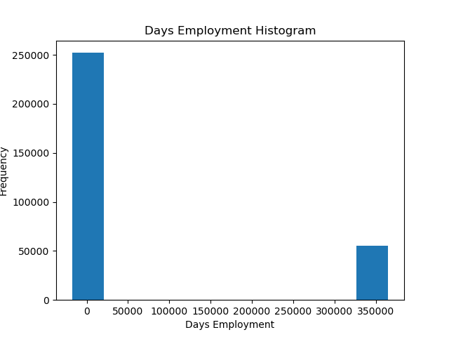
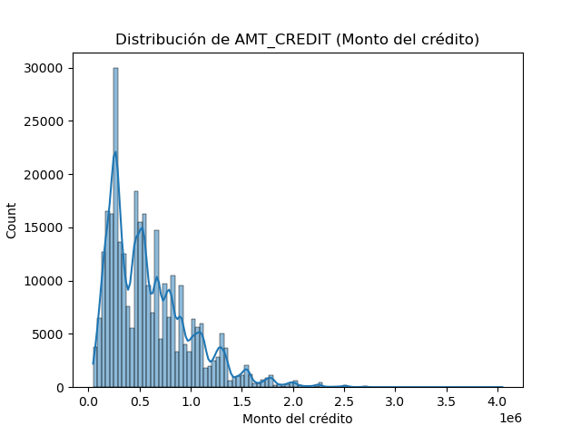
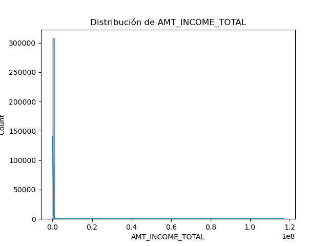
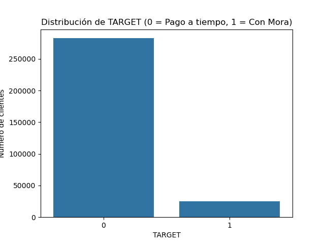
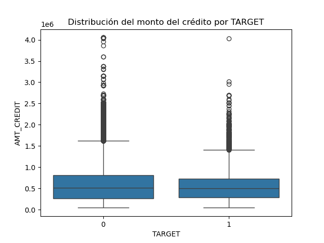

Preprocesamiento y preparación de datos
Este archivo explica el flujo de preprocesamiento aplicado al dataset de Home Credit para dejarlo listo para modelos de clustering y predicción supervisada.
# 1. Carga de archivos
Se importaron los archivos .csv relevantes, incluyendo:
- application_train, application_test
- bureau, bureau_balance
- previous_application, installments_payments
- POS_CASH_balance, credit_card_balance

# 2. Limpieza de valores nulos
Se eliminaron columnas con más del 60% de valores faltantes y se hizo imputacion de todos los dataframes (a excepcion de application) para sus valores numericos por media y para sus valores no numericos por moda.

# 3. Manejo de outliers
Se aplicó el método del rango intercuartil (IQR) para detectar y marcar outliers.
Para DAYS_EMPLOYED, se detectó un valor atípico estructural (365243) que fue reemplazado por NaN. Se encontraron otras variables con outliers, sin embargo, estas no se consideraron importantes para la limpieza de datos, ya que, seguramente no serían usadas posteriormente en los modelos por ser información no relevante, como por ejemplo los números de teléfonos de clientes o información no tan relacionada con riesgo crediticio.

# 4. Agregación de fuentes externas
Para enriquecer el conjunto principal de datos (`application_train`), se integró información histórica desde otras tablas relacionadas (`bureau`, `installments_payments`, `previous_application`, `POS_CASH_balance`, `credit_card_balance`), todas vinculadas por la clave común `SK_ID_CURR`.
Dado que estas tablas contienen múltiples registros por cliente, se realizó una **agregación numérica**, convirtiendo estos registros múltiples en una sola fila por cliente.
Se aplicaron las funciones estadísticas `count`, `mean`, `max`, `min` y `sum` a las columnas numéricas, permitiendo resumir el comportamiento histórico del cliente (por ejemplo: total pagado, número de créditos previos, deuda máxima, etc.).

Las nuevas columnas fueron renombradas con un prefijo que indica su origen (`BUREAU_`, `PREV_`, `INST_`, `POS_`, `CC_`), y luego se integraron mediante `merge` al dataset principal.

# 5. Análisis exploratorio inicial

Se generaron histogramas y boxplots para analizar:
- La distribución del monto del crédito (AMT_CREDIT)
Como se observa en la siguiente gráfica, la distribución es fuertemente sesgada a la derecha: la mayoría de los créditos son menores a 1 millón, pero existen algunos valores extremos que representan créditos mucho más grandes.
Esto es importante para:
  - Justificar el uso de estadísticas robustas como la mediana
  - Tener precaución con los modelos sensibles a escalas
  - Identificar la necesidad de técnicas de normalización si fuera necesario

  
- Ingresos (AMT_INCOME_TOTAL)
En la siguiente gráfica se muestra el histograma de la variable `AMT_INCOME_TOTAL`, que representa el ingreso total declarado por cada cliente.
La distribución es altamente asimétrica hacia la derecha, indicando que la mayoría de los clientes tienen ingresos modestos, mientras que unos pocos reportan ingresos extremadamente altos.
Esto sugiere la necesidad de:
  - Aplicar **transformaciones** (logarítmica) si fuera usada directamente en modelos sensibles
  - Probablemente aplicar otras medidas para evitar los outliers en esta variable
  - Usar medidas como la **mediana** para imputación o análisis central

- Relación entre el monto del crédito y la variable objetivo (TARGET)
Se evaluó la relación entre `AMT_CREDIT` y `TARGET` (si el cliente cayó o no en mora) mediante un boxplot.
Como se puede observar en la siguiente figura, las distribuciones de `AMT_CREDIT` son bastante similares entre los dos grupos. La mediana es ligeramente menor para los clientes que cayeron en mora (`TARGET = 1`), pero no hay una diferencia estructural clara.
Esto sugiere que el monto del crédito, por sí solo, **no permite discriminar fuertemente el riesgo de mora**, aunque puede ser útil en combinación con otras variables.

- También se evaluó el desbalance de clases:
Solo ~8% de los clientes caen en mora (TARGET = 1), con lo cual tenemos una variable a pronosticar notablemente desbalanceada.

- Se calcularon las correlaciones entre las variables numéricas y la variable objetivo `TARGET` para identificar patrones lineales de asociación.
Las siguientes variables mostraron **correlación negativa más fuerte** con `TARGET`:

| Variable                               | Correlación |
|----------------------------------------|-------------|
| EXT_SOURCE_3                           | -0.1789     |
| EXT_SOURCE_2                           | -0.1605     |
| EXT_SOURCE_1                           | -0.1553     |
| BUREAU_BB_MONTHS_BALANCE_COUNT_MEAN    | -0.0802     |
| BUREAU_BB_MONTHS_BALANCE_COUNT_MAX     | -0.0688     |
| BUREAU_BB_MONTHS_BALANCE_COUNT_MIN     | -0.0482     |
| PREV_DAYS_FIRST_DRAWING_MIN            | -0.0445     |
| FLOORSMAX_AVG                          | -0.0440     |
| FLOORSMAX_MEDI                         | -0.0438     |
| FLOORSMAX_MODE                         | -0.0432     |

Estas variables podrían estar relacionadas con mayor estabilidad económica o historial crediticio positivo.

Por otro lado, las siguientes variables mostraron **correlación positiva más fuerte** con `TARGET`:

| Variable                               | Correlación |
|----------------------------------------|-------------|
| BUREAU_DAYS_CREDIT_UPDATE_MEAN         | 0.0689      |
| BUREAU_BB_MONTHS_BALANCE_SUM_MEAN      | 0.0726      |
| BUREAU_BB_MONTHS_BALANCE_MIN_MIN       | 0.0732      |
| DAYS_EMPLOYED                          | 0.0750      |
| BUREAU_DAYS_CREDIT_MIN                 | 0.0752      |
| BUREAU_BB_MONTHS_BALANCE_MEAN_MEAN     | 0.0764      |
| DAYS_BIRTH                             | 0.0782      |
| BUREAU_BB_MONTHS_BALANCE_MIN_MEAN      | 0.0890      |
| BUREAU_DAYS_CREDIT_MEAN                | 0.0897      |

Estas variables podrían indicar **mayor riesgo de mora**, aunque las correlaciones no son extremadamente altas.
Estas correlaciones permiten hacer una primera interpretación de los factores asociados al riesgo de mora. Las variables más fuertemente correlacionadas negativamente con `TARGET` corresponden en su mayoría a los indicadores externos de riesgo (`EXT_SOURCE_1`, `EXT_SOURCE_2`, `EXT_SOURCE_3`). Esto sugiere que los clientes con mejores puntuaciones en estos sistemas externos tienen menor probabilidad de caer en mora, lo cual es coherente con el comportamiento esperado en sistemas crediticios.

Por otro lado, muchas de las variables con correlación positiva provienen del historial crediticio reportado en `bureau` y `bureau_balance`. Esto incluye medidas como `DAYS_CREDIT`, `DAYS_CREDIT_UPDATE` o recuentos y promedios de `MONTHS_BALANCE`, que reflejan frecuencia, antigüedad o intensidad del uso del crédito. En general, se observa que un historial con actividad más antigua, más extensa o más intensa podría estar asociado a un mayor riesgo de impago, especialmente si esta actividad incluye comportamientos morosos.

En conjunto, estos resultados indican que tanto las puntuaciones externas como el comportamiento histórico reportado en burós de crédito son variables relevantes para la predicción de mora, y validan su uso posterior en los modelos supervisados.

# 6. Codificación de variables categóricas
- Variables binarias: LabelEncoder
- Variables con más de dos categorías: One-Hot Encoding
Luego se alinearon app_train y app_test para garantizar las mismas columnas.

# 7. Imputación final y guardado
Se imputaron valores faltantes restantes por mediana en ambos conjuntos (app_train, app_test).
Los datasets procesados se guardaron como:
- app_train_clean.csv
- app_test_clean.csv
